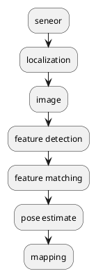

slam, simultaneous localization and mapping

- load image
  - mono
  - bin
  - rgbd
  - lidar
- feature detection
  - orb
  - sift
  - surf
- feature matching
- pose estimation
  - Fundmental
  - EnssentialMatrix
  - R&T
  - traingle
  - 
- mapping

