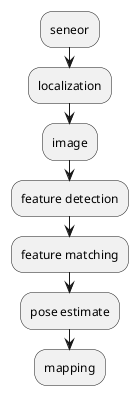

slam, simultaneous localization and mapping

- Environment config
  - Ubuntu 18.04 / Macbook
  - [OpenCV 4.5.2](https://github.com/opencv/opencv/tree/4.5.2)
  - [OpenCV Contrib 4.5.2](https://github.com/opencv/opencv_contrib/tree/4.5.2)
  - [Ceres 2.0.0](http://www.ceres-solver.org/installation.html)

SLAM

- sensors 
  - mono
  - bin
  - rgbd
  - lidar
- feature detection
  - orb
  - sift
  - surf
- feature matching
- pose estimation
  - Fundmental
  - EnssentialMatrix
  - R&T
  - traingle
  - 
- mapping

